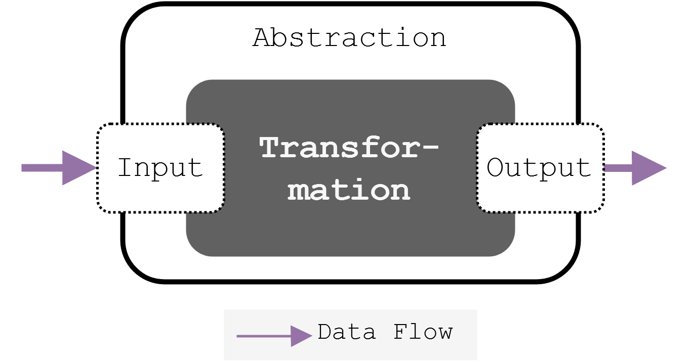

# Iterum Client Libraries

Iterum allows for the creation of client libraries for different languages. These client libraries, together with the sidecars function as a layer of abstraction between the framework and the transformation step as shown in the following image:

In this way, the transformation step does not has to concern itself with the communication with the framework, and can focus on the actual transformation step.

### Current client library implementations

* [Pyterum](https://github.com/iterum-provenance/pyterum), Python library